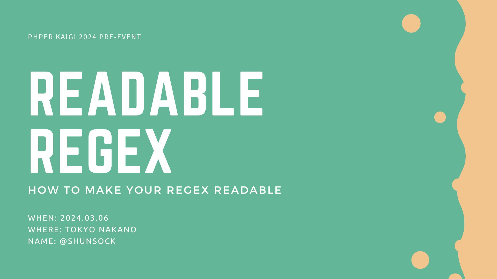

# Readable Regex Example

This is an example of a readable regex  for PHPerKaigi 2024.

## Proposal


```json
{
  "title": "Readable 正規表現",
  "date": "2024/03/07 17:30〜",
  "track": "Track A",
  "speaker": "shunsock",
  "url": "https://fortee.jp/phperkaigi-2024/proposal/eff9589b-b603-4b23-aa35-42948443a80b",
  "image_url": "https://fortee.jp/phperkaigi-2024/proposal/og-image/eff9589b-b603-4b23-aa35-42948443a80b.png"
}
```

## Presentation Slide

link: [PHPerKaigi2024_Readable_Regex](https://www.canva.com/design/DAF9IPmoHMM/Y40JL-jOOGwSE89vT9mytg/view)